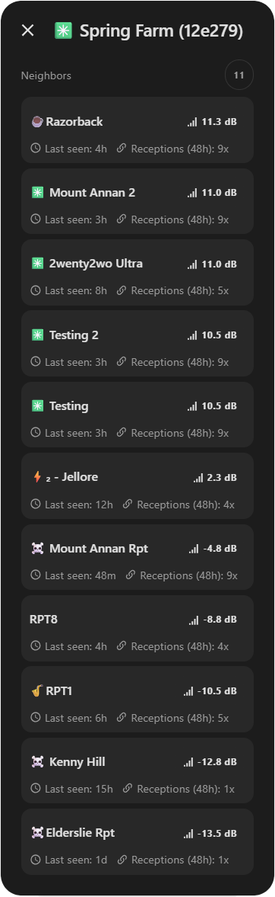

# Main card

The Main card displays one selected MeshCore hub or remote node. Add separate
cards when you want to place several devices on a dashboard.


## Quick start

For a remote node, use the exact discovered device name:

```yaml
type: custom:mushroom-meshcore-card
target:
  type: node
  id: Spring Farm
```

For a hub, use its discovered public-key identifier:

```yaml
type: custom:mushroom-meshcore-card
target:
  type: hub
  id: 55733c
```

The visual editor lists valid targets and is the easiest way to choose one. A
missing or unresolved target produces a configuration prompt instead of
selecting a device automatically.

## What the card shows

Remote nodes use a Tile-style header followed by the telemetry available for
that device, such as signal, battery, traffic, environmental readings,
location, and repeater diagnostics. Hubs use the same layout for their
available hardware, firmware, radio, location, and MQTT details.

Missing readings are omitted. An offline node collapses to a short identity and
last-seen summary instead of filling the card with unavailable values.

## Common customisation

The visual editor covers appearance, interactions, chip layout, entity
overrides, map links, and dashboard sizing. The same options are available in
YAML:

```yaml
type: custom:mushroom-meshcore-card
target:
  type: node
  id: Spring Farm
name: Spring Farm Repeater
icon: mdi:radio-tower
icon_color: blue
hold_action:
  action: navigate
  navigation_path: /lovelace/mesh
```

Supporting entities are discovered automatically through Home Assistant's
registries. Flat entity overrides are available for unusual setups. See the
[configuration reference](/configuration#main-card) for every option and the
supported header actions.

## Arrange chips

The editor lets you order chips in **Top**, **Details**, and **Hidden** areas.
In YAML, `chip_layout` is a complete layout, so any supported chip omitted from
all three lists is hidden. See [Chip layout and metrics](/chips) for the default
layouts and available chip IDs.

## Recent neighbours

For supported repeater nodes, the neighbour count contains only neighbours that
the integration can prove were heard within its rolling 48-hour window.
Selecting the chip opens a list sorted by SNR. Contact names are resolved when
the corresponding MeshCore contact is known; otherwise a shortened identifier
is shown.



Nodes without compatible neighbour data simply omit the chip. Its visibility
and row-limit options are listed in the [configuration reference](/configuration#main-card-fields).

For installation and first-card setup, see [Getting started](/getting-started).
For styling, see [Theming and Card Mod](/theming). For missing targets, metrics,
or neighbour data, see [Troubleshooting](/troubleshooting).
