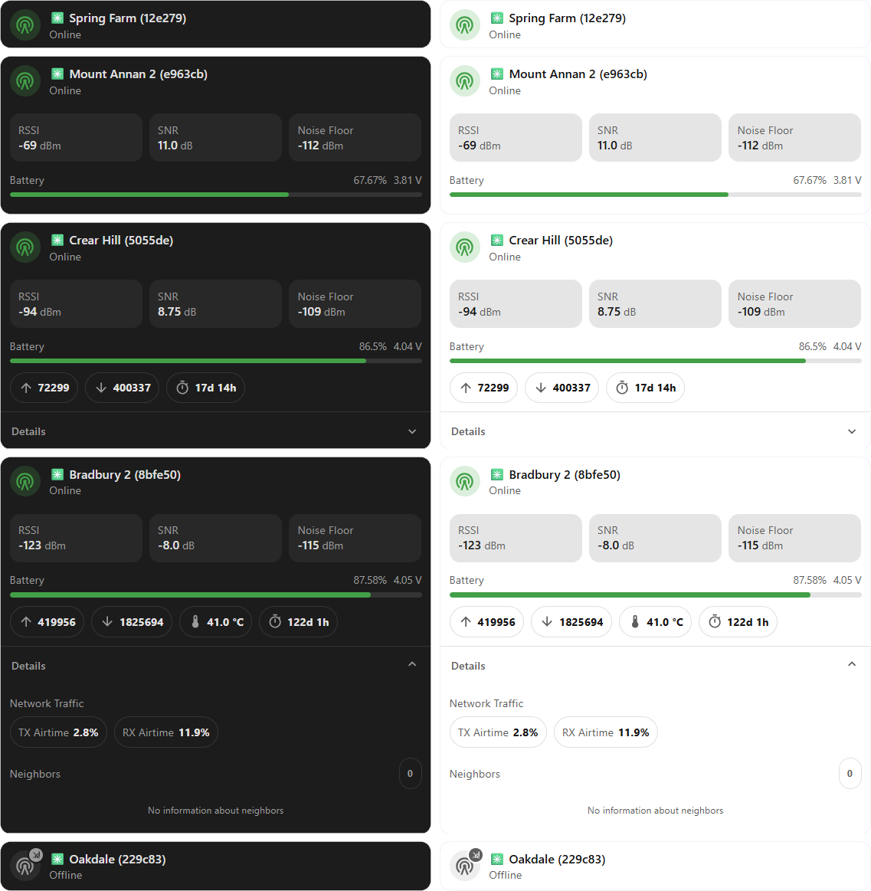
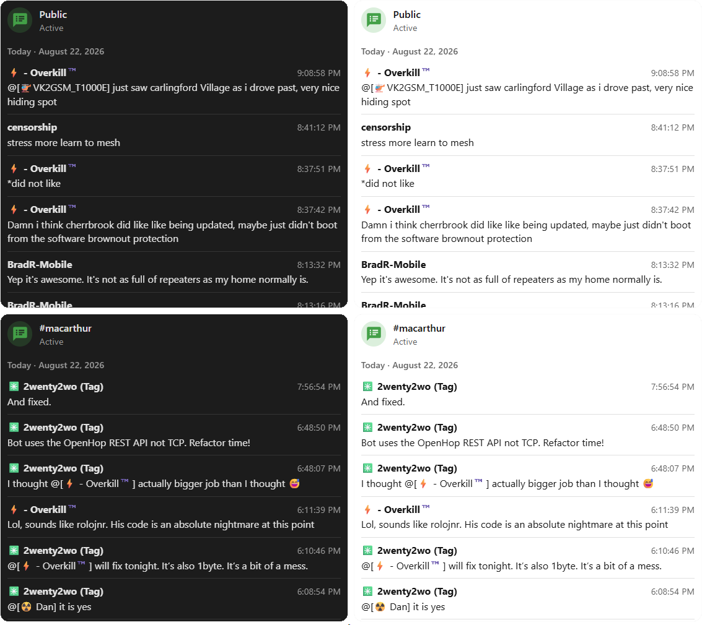
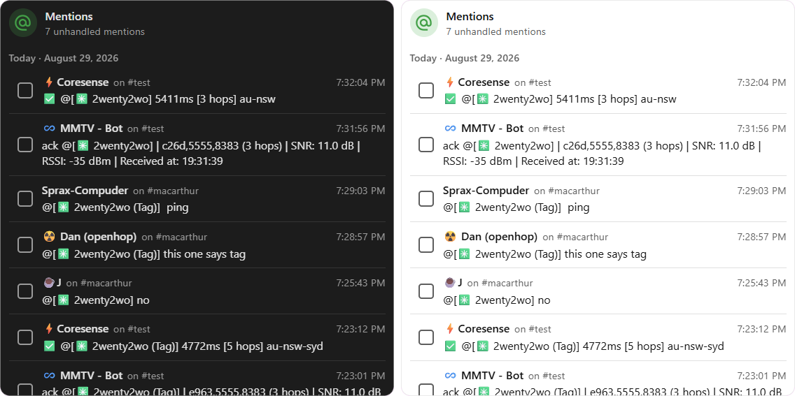
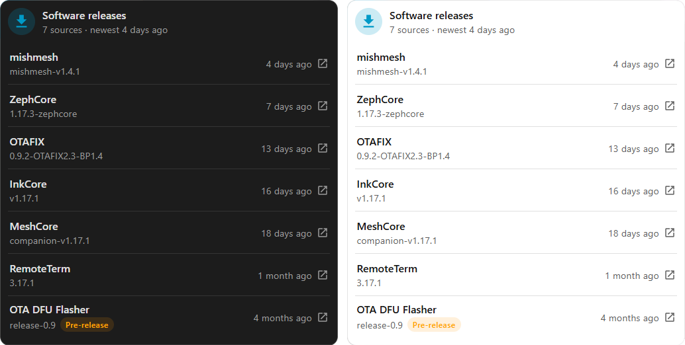

<section id="cards" class="mmc-home-cards" aria-labelledby="mmc-home-cards-heading">
  

    <h2 id="mmc-home-cards-heading">See the cards</h2>
    
Real card views in light and dark Home Assistant themes. Supporting device data is discovered automatically wherever possible, and Mushroom and Card Mod remain optional.

  

  

    <a class="mmc-home-preview mmc-home-preview--main" href="./cards/main.html">
      
      
        
          <strong>Main card</strong>
          View guide →
        
        Status and available telemetry for one selected hub or remote node.
      
    </a>
    

      <a class="mmc-home-preview" href="./cards/channel.html">
        
        
          
            <strong>Channel card</strong>
            View guide →
          
          Recent messages from one MeshCore channel, with route context when available.
        
      </a>
      

        <a class="mmc-home-preview" href="./cards/mentions.html">
          
          
            
              <strong>Mentions card</strong>
              View guide →
            
            A dated To-do inbox for messages that tag you.
          
        </a>
        <a class="mmc-home-preview" href="./cards/releases.html">
          
          
            
              <strong>Releases card</strong>
              View guide →
            
            Versions and published dates from the release sensors you choose.
          
        </a>
      

    

  

</section>
